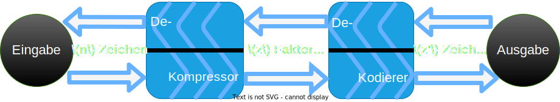

<!-- _paginate: skip -->

# Parallelisierung einer speichereffizienten Approximation der LZ77-Faktorisierung

Gajann Sivarajah

---

<!-- footer: Gajann Sivarajah-->

## Verlustfreie LZ-Kompression

---

## LZ77 - Faktorisierung

---

## Approx. LZ77 - Faktorisierung

---

## Parallelisierung - Konzept

---

## Parallelisierung - Implementierung

---

## Parallelisierung - Evaluation

---

## Was lernen wir?