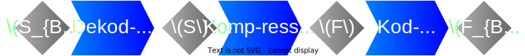
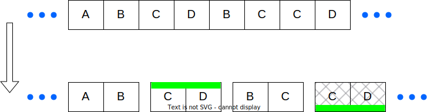
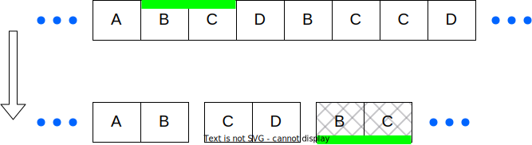
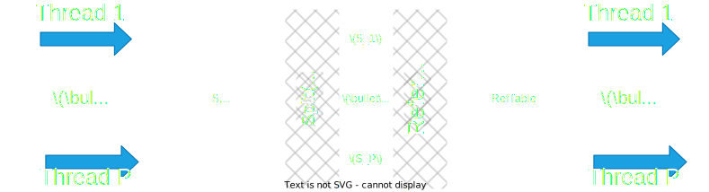
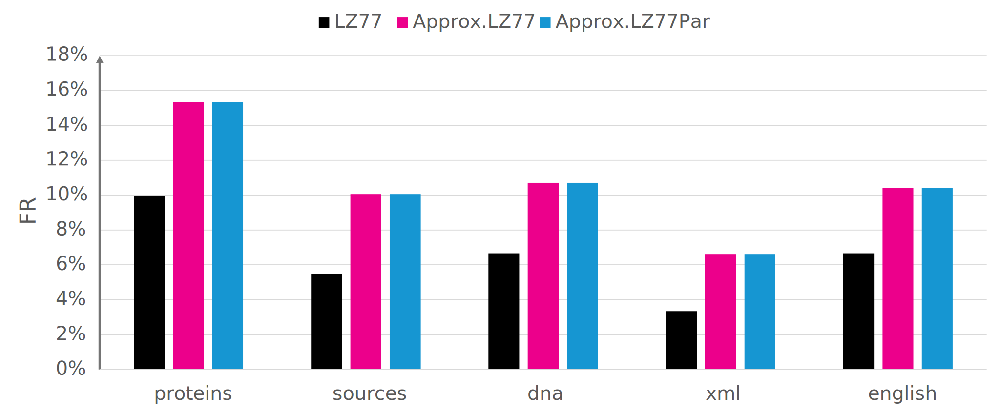
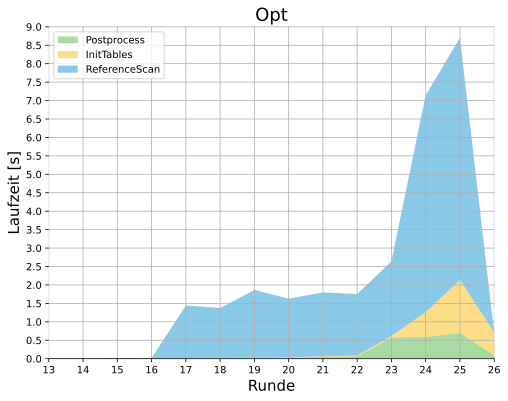

<!-- _paginate: skip -->

# Parallelisierung einer speichereffizienten Approximation der LZ77-Faktorisierung

Gajann Sivarajah

---

<!-- footer: Gajann Sivarajah-->

## LZ-Kompression - Schema

* ### Eingabe: $\large{S=e_1...e_n}$
  - $\large{e_i\in\Sigma =\{0,...,255\}}$
* ### Ausgabe: $\large{F=(f_1,...,f_z) \text{ mit } S=f_1\cdot\cdot\cdot f_z}$
  - $\large{f_i = \begin{cases}
(Länge, Position) & \text{, falls Referenz} \\
(0, Zeichen) & \text{, sonst}
\end{cases}}$

---

## LZ-Kompression - Metriken

### Qualität:
- $FR=\cfrac{|F|}{|S|}\Longleftrightarrow CR=\cfrac{|F_{Bin}|}{|S_{Bin}|}$

### Perfomanz:
- $Speicher: \cfrac{Peak\_Alloc}{|S|}[Byte]$
- $Zeit: T(|S|,P)[Sekunden]$
  - $P:=Anzahl \text{ }Prozessoren$

---

# (exakte) LZ77-Faktorisierung

---

## LZ77

### Konzept:
- $\large{\text{Scanne S von links nach rechts}}$
- $\large{\text{Maximiere stets Präfix mit vorherigem Vorkommen}}$
$\large{\Rightarrow \text{Greedy-Ansatz}}$

### Performanz:
- $\large{\text{Zeit: }O(n)}$
- $\large{\text{Speicher: }O(n) (>12n \text{ Bytes})}$

---

## LZ77 - Beispiel

---

# Approx.LZ77

---

## Approx. LZ77 - Konzept

### Ablauf:
- $\large{\text{Rundenbasierter Algorithmus}}$
- $\large{\text{Runde }r\Rightarrow \text{Extrahiere Faktoren der Länge } \cfrac{n}{2^r}}$
- $\large{\text{Endrunde }r_{End}=\log{n}\Rightarrow \text{S ist komplett faktorisiert}}$

---

## Approx. LZ77 - Konzept
### Runde:
- $\large{\text{(Noch unverarbeitete) Zeichenfolge in Blöcke aufteilen}}$
- $\large{\text{Unter den Blöcken Duplikate/Referenzen finden}(\bf{InitTables})}$

---

## Approx. LZ77 - Konzept
### Runde:
- $\large{\text{(Noch unverarbeitete) Zeichenfolge in Blöcke aufteilen}}$
- $\large{\text{Unter den Blöcken Duplikate/Referenzen finden}(\bf{InitTables})}$
- $\large{\text{Freie Suche nach Referenzen in S}(\bf{ReferenceScan})}$

---

## Approx. LZ77 - Konzept
### Runde:
- $\large{\text{(Noch unverarbeitete) Zeichenfolge in Blöcke aufteilen}}$
* $\large{\text{Unter den Blöcken Duplikate/Referenzen finden}(\bf{InitTables})}$
* $\large{\text{Freie Suche nach Referenzen in S}(\bf{ReferenceScan})}$
* $\large{\textbf{Block + Referenz}\Rightarrow \textbf{Faktor}}$

---

## Approx. LZ77 - Konzept
### InitTables
- $\large{\text{String-Matching} \Rightarrow \text{Rabin-Karp-Fingerprint }(RFP)}$
* $\large{\text{Erzeuge }RFPTable\text{ und }RefTable}$:
  - $\large{RFPTable(RFP)=\text{Linkester Block mit RFP als Hash}}$
  - $\large{RefTable(Block)=\begin{cases}
    \text{Referenzposition}& \text{,falls bekannt} \\
    \text{Blockposition} Block&\text{, sonst}
     \end{cases}}$
* $\large{\text{Blöcke außerhalb der RFPTable } \Rightarrow \textbf{Faktoren}}$

---

## Approx. LZ77 - Konzept
### ReferenceScan
- $\large{\text{Scan von links nach rechts }\Rightarrow \text{Bewege RFP-Fenster}}$
- $\large{\text{Treffer in RFPTable + Links vom Block} \Rightarrow \textbf{Faktor}}$

---

## Approx. LZ77 - Performanz
### Zeit: $\large{O(n\log{n})}$
### Speicher: $\large{O(z)}$

---

# Parallelisierung - Approx.LZ77Par

---

## Approx. LZ77Par - InitBlocks

---

## Approx. LZ77Par - InitTables

---

## Approx. LZ77Par - ReferenceScan

---

# Praktische Optimierungen

---

## Optimierungen - DynStart

---

## Optimierungen - DynStart

---

## Optimierungen - DynStart

---

## Optimierungen - DynStart

$\Large{\Rightarrow r_{init}=\cfrac{\log{n}}{2}}$
$\Large{\Rightarrow r_{DynStart}=r_{init}-\lfloor \log{longestChain(B_{init}^{marked})}\rfloor}$

---

## Optimierungen - PreMatching
- $\large{\text{Berechne Runde } r_{PreMatch} \text{ vor}}$
- $\large{\text{Nutze RFPs für Konkatenation von Blöcken}}$
- $\large{\text{Nutze nicht-markierte Blöcke als Filter}}$
$\large{\Rightarrow (\exists b\in \{b_1,...,b_i\}) \notin B^{marked}_* \Rightarrow (b_1\cdot \cdot \cdot b_i) \notin B^{marked}_*}$

---

## Optimierungen - DynEnd
- $\large{\text{Kodierung }K_{OUT}: F\rightarrow \{0,1\}^*}$
- $\large{Min_{Ref}:=\textbf{Mindestanzahl Bits Referenz-Faktor}}$
- $\large{Max_{Lit}:=\textbf{Maximale Bits für referenzloses Zeichen}}$
- $\large{len_{ref}<len_{min}=\lceil \cfrac{Min_{Ref}}{Max_{Lit}} \rceil \Rightarrow \text{ Kodierung lohnt sich nicht}}$
$\large{\Rightarrow \text{Neue Endrunde: } r_{DynEnd}=\log{n}-\lceil \log{len_{min}}\rceil}$
---

## Optimierungen - ScanSkip
- $\large{|F_{ReferenceScan}|\leq |RFPTable|=|Blocks|-|F_{InitTables}|}$
* $\large{k=\cfrac{|RFPTable|}{|Blocks|}}$

* $\large{\text{Führe ReferenceScan nur bei } \bf{k\geq k_{min}\in [0,1]} \text{ durch}}$

---

# Praktische Evaluation

---

## Evaluation - Qualität(FR)

---

## Evaluation - Speicher

---

## Evaluation - Zeit

---

## Evaluation - Speedup

- $SP(P=16)\approx 6.19$

---

## Evaluation - Speedup

- $SP(P=128)\approx 12$
---

## Evaluation - Optimierungen (proteins)

---

## Fazit

### Zusammenfassung
- $\text{Approx. LZ77 }\rightarrow \text{Approx. LZ77Par : Korrektheit bestätigt}$
- $\text{Zeitersparnis durch Optimierungen stichprobenartig nachgewiesen}$
- $\text{Zeit(Approx. LZ77Par) < Zeit(LZ77) < Zeit(Approx. LZ77)}$
- $\text{Speicher(Approx. LZ77Par) }\approx\text{ Speicher(Approx. LZ77) < Speicher(LZ77)}$

### Offene Punkte
- $\text{Alternative Techniken (Hashtabelle, Bloom-Filter,...)}$
- $\text{Dynamische Generierung der Parameter }r_{PreMatch}\text{ und }k_{min}$
- $\text{Zweite und Dritte Phase des Approximationsalgorithmus}$

---

# Vielen Dank