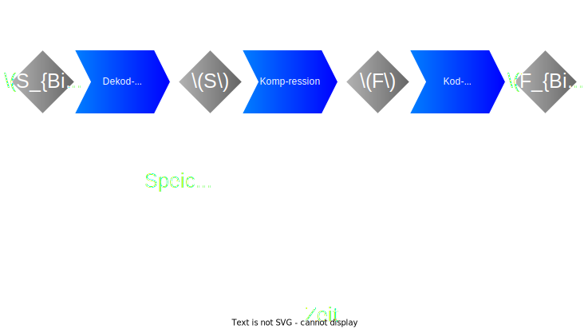
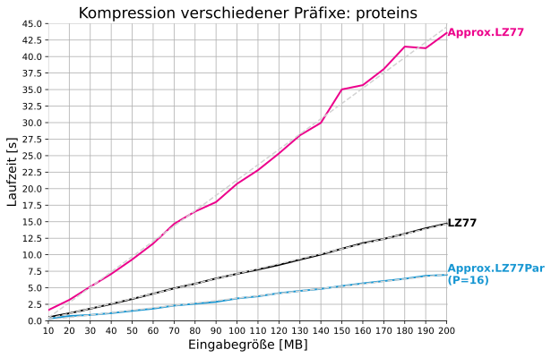
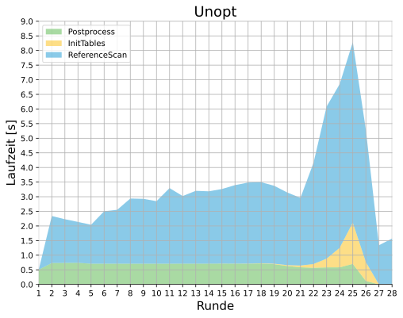

<!-- _paginate: skip -->

# Parallelisierung einer speichereffizienten Approximation der LZ77-Faktorisierung

Gajann Sivarajah

---

<!-- footer: Gajann Sivarajah-->

## LZ-Kompression - Konzept
### Eingabe: $S=e_1...e_n$
- $e_i\in\Sigma =\{0,...,255\}$
### Ausgabe: $F=(f_1,...,f_z)$
- $f_1\cdot\cdot\cdot f_z=S$
- $f_i = \begin{cases}
(Länge, Position) & \text{, falls Referenz} \\
(0, Zeichen) & \text{, sonst}
\end{cases}$

### Algorithmus: $COMP_{LZ}:S\rightarrow F$ $\Longleftrightarrow$ $DECOMP_{LZ}:F\rightarrow S$
---

## LZ-Kompression - Gütemaße

### Qualität:
- $FR=\cfrac{|F|}{|S|}\Longleftrightarrow CR=\cfrac{|F_{Bin}|}{|S_{Bin}|}$

### Perfomanz:
- $Speicher:\cfrac{Mem_{Peak}}{|S|}$
- $Zeit: T(|S|,P)$

---

## LZ77

### Konzept:
- Scanne von links nach rechts
- Maximiere jeden Faktor $|f_i|\rightarrow Greedy$

### Zeit / Speicher:
- Zeit: $O(n)$
- Speicher: $O(n)$

---

## Approx. LZ77 - Konzept

### Ablauf:
- Rundenbasierter Algorithmus
- Runde $r\Rightarrow$ Extrahiere Faktoren der Länge $\cfrac{|S|}{2^r}$
- Letzte Runde $r_{End}=\log{|S|}\Rightarrow$ Alle Zeichen sind faktorisiert

---

## Approx. LZ77 - Konzept
### Runde:
- (Noch unverarbeitete) Zeichenfolge in Blöcke aufteilen
- Unter den Blöcken Duplikate/Referenzen finden($InitTables$)
- Freie Suche nach Referenzen in S ($ReferenceScan$)
- Extrahiere Faktoren aus Referenzen

---

## Approx. LZ77 - Konzept
### InitTables
- Erzeuge $RFPTable$ und $RefTable$:
    - $RFPTable(RFP)=\text{Linkester Block mit RFP als Hash}$
    - $RefTable(Block)=\begin{cases}
    \text{Position einer Referenz zu }Block & \text{,falls bekannt} \\
    \text{Position von } Block&\text{, sonst}
     \end{cases}$
- Blöcke, die nicht in $RFPTable$ eingetragen werden $\Rightarrow$ **Faktoren**

---

## Approx. LZ77 - Konzept
### ReferenceScan
- Scan von links nach rechts $\Rightarrow$ Bewege RFP-Fenster
- Treffer in RFPTable + Links von Eintrag in RefTable $\Rightarrow$ **Faktor**

---

## Approx. LZ77 - Güte
### Zeit: $O(n\log{n})$
### Speicher: $O(z)$

---

## Approx. LZ77Par - S $\Rightarrow$ Blöcke

---

## Approx. LZ77Par - InitTables

---

## Approx. LZ77Par - ReferenceScan

---

## Optimierungen - DynStart

---

## Optimierungen - DynStart

---

## Optimierungen - DynStart

---

## Optimierungen - DynEnd
- Kodierung $K_{OUT}: F\rightarrow \{0,1\}^*$
- $Min_{Ref}:=\textbf{Mindestanzahl Bits für referenzierenden Faktor}$
- $Max_{Lit}:=\textbf{Maximale Bits für referenzloses Zeichen}$
- Kodierung eines referenzierenden Faktors lohnt sich für mehr als
$\lceil \cfrac{Min_{Ref}}{Max_{Lit}} \rceil$ referenzierte Zeichen
$\Rightarrow$ Stoppe Algorithmus in Runde $\log{|S|}-\lceil \log{\cfrac{Min_{Ref}}{Max_{Lit}}}\rceil$
---

## Optimierungen - PreMatching
- Auslassen?

---

## Optimierungen - ScanSkip
- $|F_{ReferenceScan}|\leq |RFPTable|=|Blocks|-|F_{InitTables}|$
- $k=\cfrac{|RFPTable|}{|Blocks|}$

- Führe ReferenceScan nur bei $k\geq k_{min}\in [0,1]$ durch

---

## Evaluation - Qualität(FR)

|**COMP**|**proteins**|**sources**|&nbsp;&nbsp;&nbsp;&nbsp;**dna**&nbsp;&nbsp;&nbsp;&nbsp;|&nbsp;&nbsp;&nbsp;&nbsp;**xml**&nbsp;&nbsp;&nbsp;&nbsp;|**english**|
|--------|:----------:|:---------:|:-----:|:-----:|:---------:|
|**LZ77**|$9.95\%$|$5.50\%$|$6.66\%$|$3.35\%$|$6.66\%$|
|**Approx. LZ77**|$15.34\%$|$10.05\%$|$10.71\%$|$6.62\%$|$10.42\%$|
|**Approx. LZ77Par**|$15.34\%$|$10.05\%$|$10.71\%$|$6.62\%$|$10.42\%$|

---

## Evaluation - Speicher

|**COMP**|**proteins**|**sources**|&nbsp;&nbsp;&nbsp;&nbsp;**dna**&nbsp;&nbsp;&nbsp;&nbsp;|&nbsp;&nbsp;&nbsp;&nbsp;**xml**&nbsp;&nbsp;&nbsp;&nbsp;|**english**|
|--------|:----------:|:---------:|:-----:|:-----:|:---------:|
|**LZ77**|$14.88$|$13.44$|$13.44$|$12.72$|$13.44$|
|**Approx. LZ77**|$9.94$|$6.42$|$8.38$|$3.46$|$7.06$|
|**Approx. LZ77Par**|$10.21$|$5.90$|$6.66$|$3.46$|$6.16$|

---

## Evaluation - Zeit - Sequentiell

---

## Evaluation - Zeit - Parallel

---

## Evaluation - Optimierungen

---

## Fazit

### Zusammenfassung
- Approx. LZ77 $\rightarrow$ Approx. LZ77Par : Korrektheit nachgewiesen
- Zeitersparnis durch Optimierungen stichprobenartig nachgewiesen
- Zeit(Approx. LZ77Par) $<$ Zeit(LZ77) $<$ Zeit(Approx. LZ77)
- Speicher(Approx. LZ77Par) $\approx$ Speicher(Approx. LZ77) < Speicher(LZ77)

### Offene Punkte
- Alternative Techniken (Hashtabelle, Bloom-Filter,...)
- Dynamische Generierung der Parameter $r_{PreMatch}$ und $k_{min}$
- Zweite und Dritte Phase des Approximationsalgorithmus